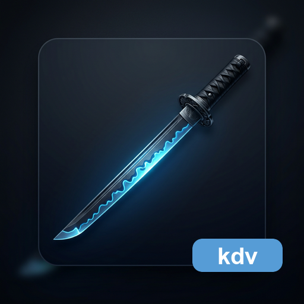

<p align="center">
  
</p>

<h1 align="center">katana-document-viewer</h1>

<p align="center">
  Vendor-neutral Markdown viewer and export library for
  <a href="https://github.com/HiroyukiFuruno/KatanA">KatanA</a>.
</p>

<p align="center">
  <a href="LICENSE"></a>
  <a href="https://github.com/HiroyukiFuruno/katana-document-viewer/actions/workflows/test-and-build.yml"></a>
  
</p>

---

## Design

Two-crate structure separates interface from implementation:

```
katana-document-viewer         ← neutral trait + DTO (no egui, no framework)
katana-document-viewer-kuc     ← katana-ui-core based viewer/export implementation
```

KatanA depends on the neutral interface and the KUC implementation. KDV does
not own editor-viewer synchronization control; KatanA commands viewer or editor.

HTML/PDF/PNG/JPG export belongs to KDV so viewer display and export share the
same render pipeline. Diagram rendering is delegated through KDR for the direct
Mermaid / Draw.io path. Unsupported diagram or Markdown semantics stay in KDV
as diagnostics and raw source until KMM or KDR exposes the needed public
contract.

`v0.1.0` starts with the UI-independent artifact/forge/export foundation. It
depends on KMM for Markdown structure and KDR for direct diagram rendering
boundaries. KDV does not fill KMM parser gaps by reparsing Markdown; unsupported
or not-yet-structured Markdown semantics are carried as diagnostics and raw
source until KMM/KDR provide the needed public contract.

## Status

Scaffolding. This repository is being renamed from `katana-document-preview`
to `katana-document-viewer` before its first release.

## License

MIT
