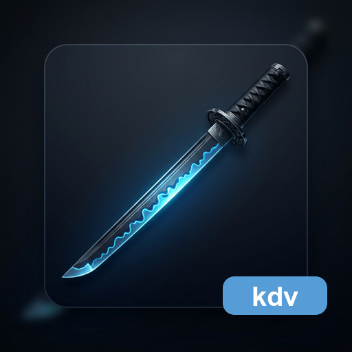

<p align="center">
  
</p>

<h1 align="center">kdv</h1>

<p align="center">
  Vendor-neutral Markdown viewer and export library for
  <a href="https://github.com/HiroyukiFuruno/KatanA">KatanA</a>.
</p>

<p align="center">
  <a href="LICENSE"></a>
  <a href="https://github.com/HiroyukiFuruno/katana-document-viewer/actions/workflows/test-and-build.yml"></a>
  
</p>

---

## Design

The published crate owns the complete document-viewer boundary:

```
KatanA -> katana-document-viewer -> katana-ui-core / katana-render-runtime
```

KDV uses KUC internally and exposes only backend-neutral KDV document frames,
input, state, capability, and diagnostic APIs. KDV does not depend on egui,
eframe, or another application UI backend. KUC types are not part of KDV's
public API, and KatanA does not depend on KUC for this integration. KDV does not
own editor-viewer synchronization control; KatanA commands viewer or editor.

HTML/PDF/PNG/JPG export belongs to KDV so viewer display and export share the
same render pipeline. Diagram and math rendering are delegated through KRR
(katana-render-runtime). Unsupported diagram or Markdown semantics stay in KDV
as diagnostics and raw source until KMM or KRR exposes the needed public
contract.

`v0.1.0` starts with the UI-independent artifact/forge/export foundation. It
depends on KMM for Markdown structure and KRR for direct render runtime
boundaries. KDV does not fill KMM parser gaps by reparsing Markdown; unsupported
or not-yet-structured Markdown semantics are carried as diagnostics and raw
source until KMM/KRR provide the needed public contract.

## Status

Scaffolding. The crates.io package is `katana-document-viewer`.

## Release governance

Run `just install-governance-hook` once per checkout. It installs the KDV
Issue-linked pre-push dispatcher and records an executable existing pre-push
hook as its delegate instead of replacing it. A non-default branch push must
reference an Open KDV Issue; dependency updates additionally require public
registry, migration, manifest, lockfile, and verification evidence in that
Issue.

After a published GitHub Release, run
`python3 scripts/release/post-release-cleanup.py --repo HiroyukiFuruno/katana-document-viewer --version vX.Y.Z --scope local --apply`
from a clean checkout. The default mode is audit-only; `--apply` removes only
independently clean, merged, unused local worktrees and branches. The release
workflow performs the corresponding safe remote release-branch cleanup.

## License

MIT
