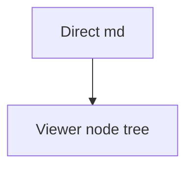

# Direct Markdown Fixture

This file validates direct `.md` loading from repository-owned fixtures.

- Standard list item
- [x] Completed task

```mermaid
graph TD
  A[Direct md] --> B[Viewer node tree]
```
