# Mermaid Sample Diagrams

This fixture covers all Mermaid diagram type variants for validation.

---

## 1. Flowchart

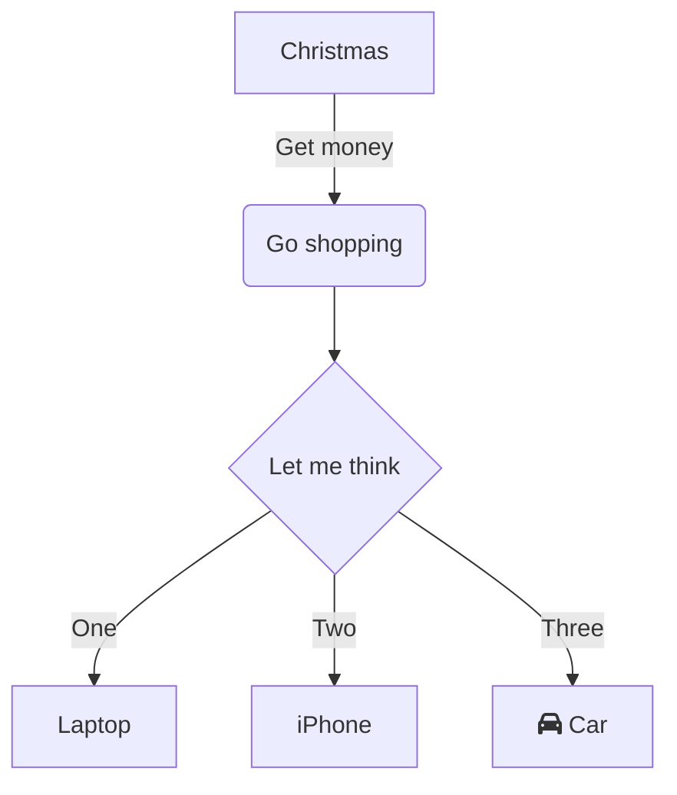
```mermaid
flowchart TD
    A[Christmas] -->|Get money| B(Go shopping)
    B --> C{Let me think}
    C -->|One| D[Laptop]
    C -->|Two| E[iPhone]
    C -->|Three| F[fa:fa-car Car]
```

## 2. Graph

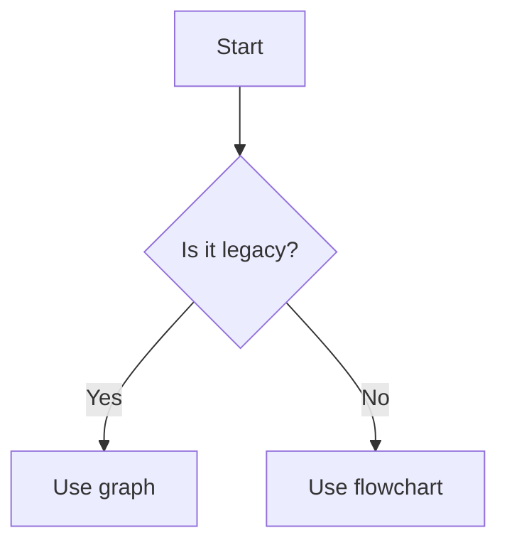
```mermaid
graph TD
    A[Start] --> B{Is it legacy?}
    B -- Yes --> C[Use graph]
    B -- No --> D[Use flowchart]
```

## 3. Class Diagram

### 3.1. Class Diagram (Enumeration)

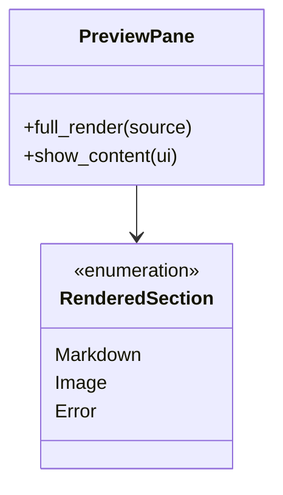
```mermaid
classDiagram
    class PreviewPane {
        +full_render(source)
        +show_content(ui)
    }
    class RenderedSection {
        <<enumeration>>
        Markdown
        Image
        Error
    }
    PreviewPane --> RenderedSection
```

### 3.2. Class Diagram (Inheritance)

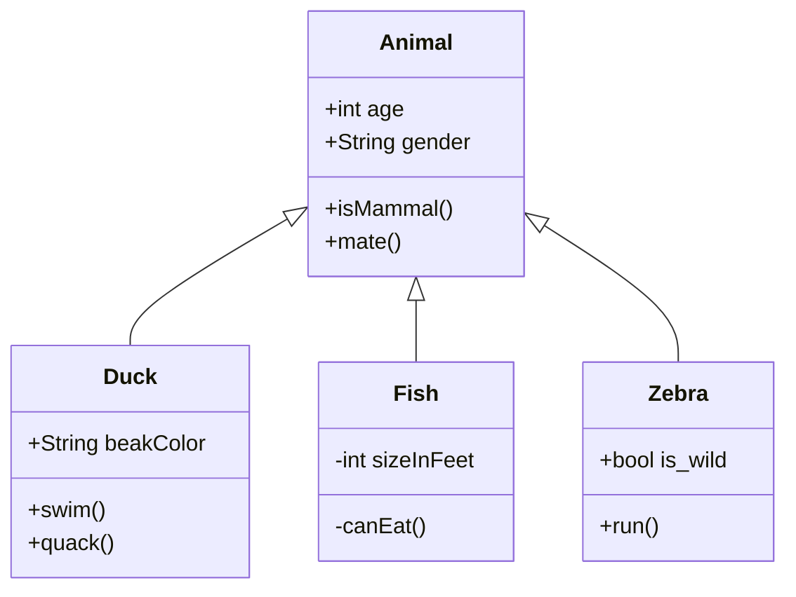
```mermaid
classDiagram
    Animal <|-- Duck
    Animal <|-- Fish
    Animal <|-- Zebra
    Animal : +int age
    Animal : +String gender
    Animal: +isMammal()
    Animal: +mate()
    class Duck{
      +String beakColor
      +swim()
      +quack()
    }
    class Fish{
      -int sizeInFeet
      -canEat()
    }
    class Zebra{
      +bool is_wild
      +run()
    }
```

## 4. Sequence Diagram

### 4.1. Sequence Diagram (Simple)

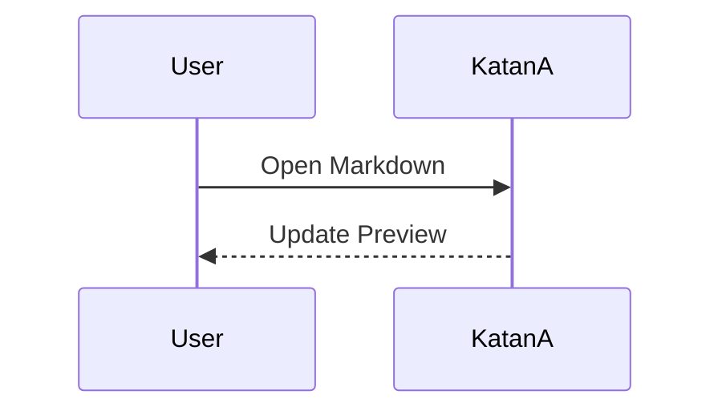
```mermaid
sequenceDiagram
    participant User as User
    participant App as KatanA
    User->>App: Open Markdown
    App-->>User: Update Preview
```

### 4.2. Sequence Diagram (Activate/Deactivate)

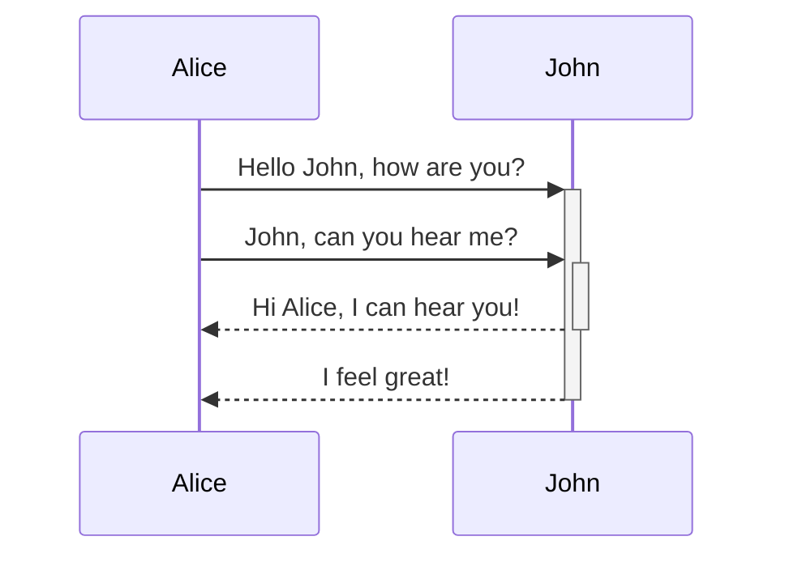
```mermaid
sequenceDiagram
    Alice->>+John: Hello John, how are you?
    Alice->>+John: John, can you hear me?
    John-->>-Alice: Hi Alice, I can hear you!
    John-->>-Alice: I feel great!
```

## 5. Entity Relationship Diagram

### 5.1. ER Diagram (Simple)

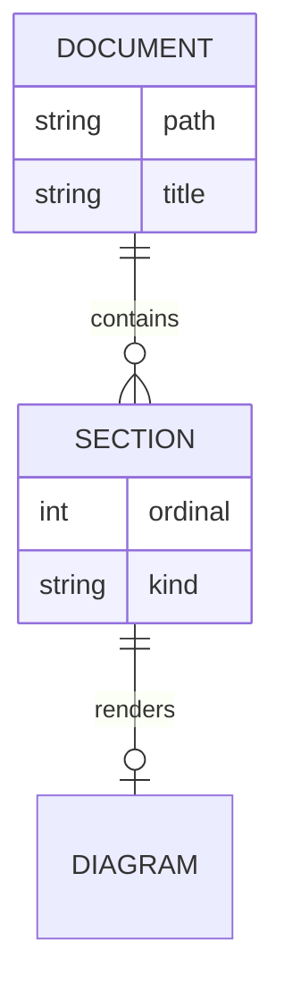
```mermaid
erDiagram
    DOCUMENT ||--o{ SECTION : contains
    SECTION ||--o| DIAGRAM : renders
    DOCUMENT {
        string path
        string title
    }
    SECTION {
        int ordinal
        string kind
    }
```

### 5.2. ER Diagram (Multi-entity)

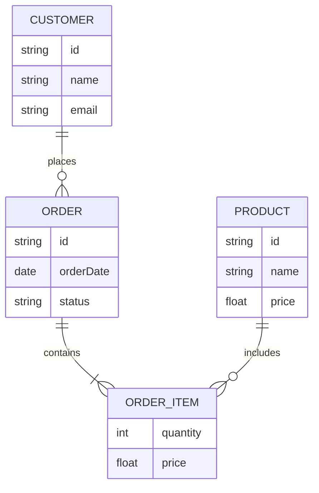
```mermaid
erDiagram
    CUSTOMER ||--o{ ORDER : places
    ORDER ||--|{ ORDER_ITEM : contains
    PRODUCT ||--o{ ORDER_ITEM : includes
    CUSTOMER {
        string id
        string name
        string email
    }
    ORDER {
        string id
        date orderDate
        string status
    }
    PRODUCT {
        string id
        string name
        float price
    }
    ORDER_ITEM {
        int quantity
        float price
    }
```

## 6. State Diagram

### 6.1. State Diagram v2 (Failure path)

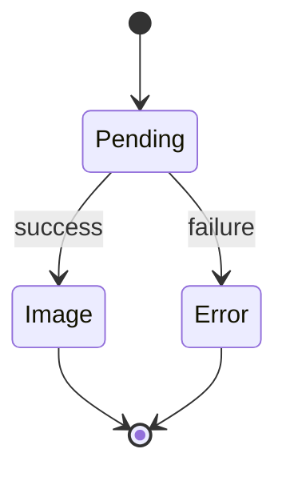
```mermaid
stateDiagram-v2
    [*] --> Pending
    Pending --> Image : success
    Pending --> Error : failure
    Image --> [*]
    Error --> [*]
```

### 6.2. State Diagram v2

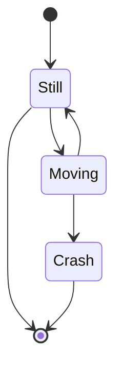
```mermaid
stateDiagram-v2
    [*] --> Still
    Still --> [*]
    Still --> Moving
    Moving --> Still
    Moving --> Crash
    Crash --> [*]
```

### 6.3. State Diagram v1


```mermaid
stateDiagram
    [*] --> Still
    Still --> [*]
    Still --> Moving
    Moving --> Still
    Moving --> Crash
    Crash --> [*]
```

## 7. Mindmap

### 7.1. Mindmap (Simple)

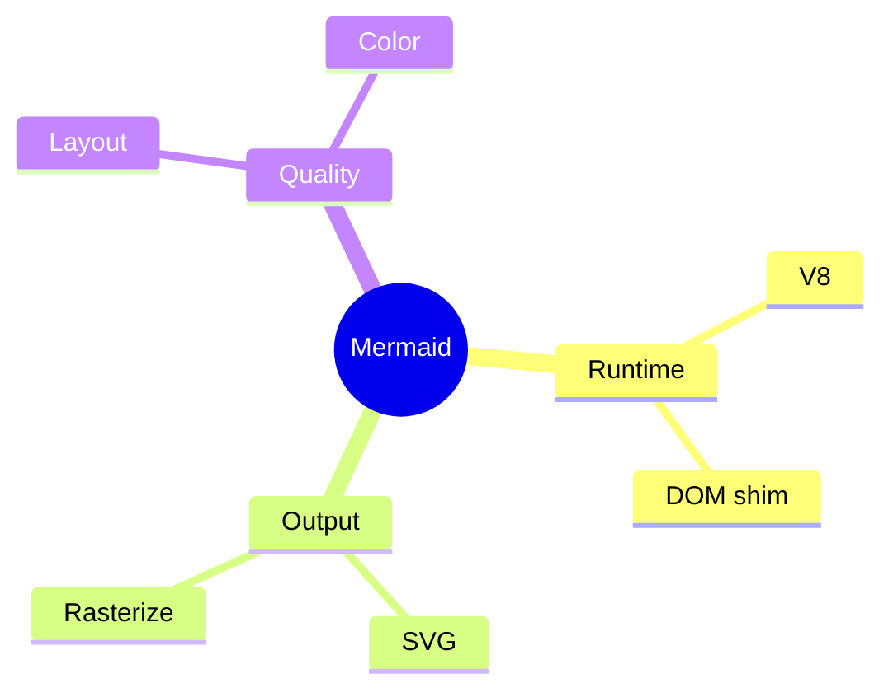
```mermaid
mindmap
  root((Mermaid))
    Runtime
      V8
      DOM shim
    Output
      SVG
      Rasterize
    Quality
      Layout
      Color
```

### 7.2. Mindmap (Icons)

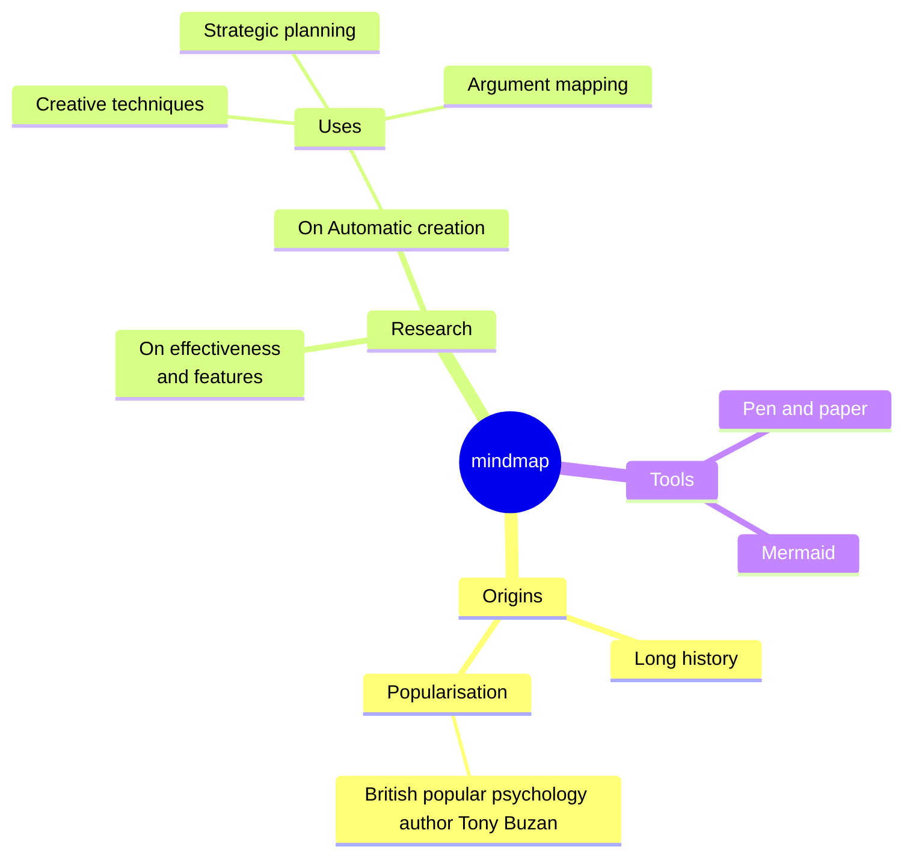
```mermaid
mindmap
  root((mindmap))
    Origins
      Long history
      ::icon(fa fa-book)
      Popularisation
        British popular psychology author Tony Buzan
    Research
      On effectiveness<br/>and features
      On Automatic creation
        Uses
            Creative techniques
            Strategic planning
            Argument mapping
    Tools
      Pen and paper
      Mermaid
```

## 8. C4

### 8.1. C4 Context (Simple)

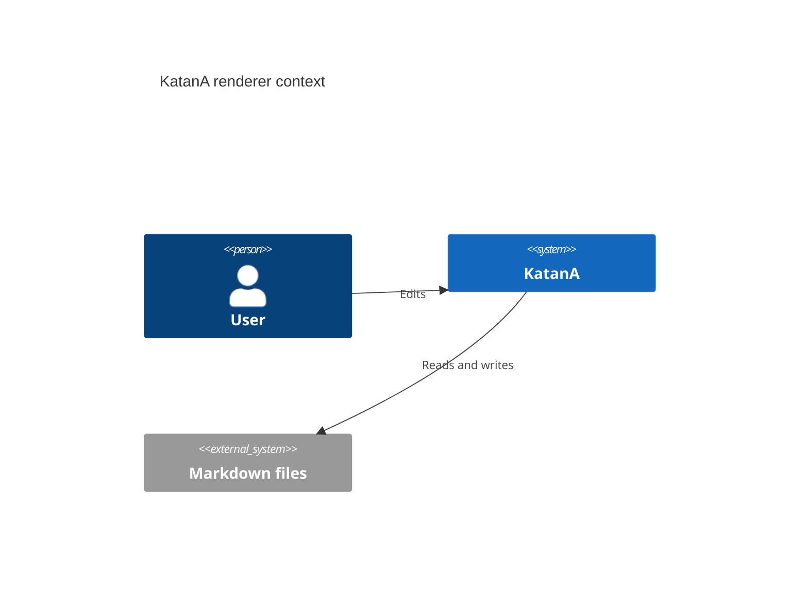
```mermaid
C4Context
    title KatanA renderer context
    Person(user, "User")
    System(katana, "KatanA")
    System_Ext(files, "Markdown files")
    Rel(user, katana, "Edits")
    Rel(katana, files, "Reads and writes")
```

### 8.2. C4 Context (Full)

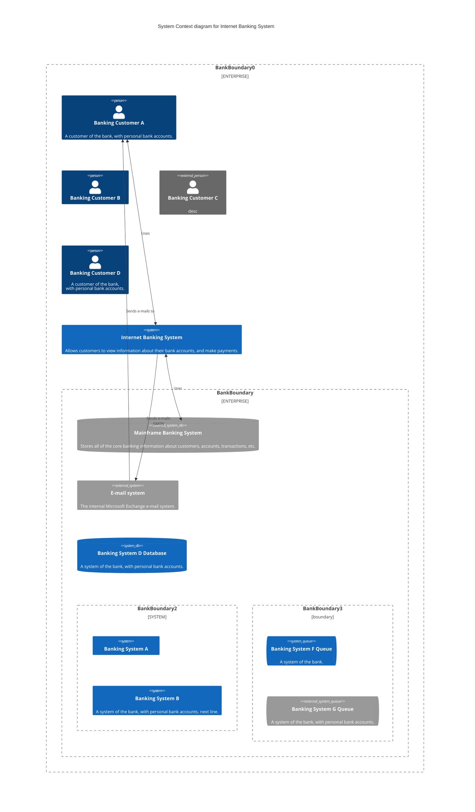
```mermaid
C4Context
    title System Context diagram for Internet Banking System
    Enterprise_Boundary(b0, "BankBoundary0") {
        Person(customerA, "Banking Customer A", "A customer of the bank, with personal bank accounts.")
        Person(customerB, "Banking Customer B")
        Person_Ext(customerC, "Banking Customer C", "desc")

        Person(customerD, "Banking Customer D", "A customer of the bank, <br/> with personal bank accounts.")

        System(SystemAA, "Internet Banking System", "Allows customers to view information about their bank accounts, and make payments.")

        Enterprise_Boundary(b1, "BankBoundary") {
            SystemDb_Ext(SystemE, "Mainframe Banking System", "Stores all of the core banking information about customers, accounts, transactions, etc.")

            System_Boundary(b2, "BankBoundary2") {
                System(SystemA, "Banking System A")
                System(SystemB, "Banking System B", "A system of the bank, with personal bank accounts. next line.")
            }

            System_Ext(SystemC, "E-mail system", "The internal Microsoft Exchange e-mail system.")
            SystemDb(SystemD, "Banking System D Database", "A system of the bank, with personal bank accounts.")

            Boundary(b3, "BankBoundary3", "boundary") {
                SystemQueue(SystemF, "Banking System F Queue", "A system of the bank.")
                SystemQueue_Ext(SystemG, "Banking System G Queue", "A system of the bank, with personal bank accounts.")
            }
        }
    }

    BiRel(customerA, SystemAA, "Uses")
    BiRel(SystemAA, SystemE, "Uses")
    Rel(SystemAA, SystemC, "Sends e-mails", "SMTP")
    Rel(SystemC, customerA, "Sends e-mails to")
```

### 8.3. C4 Container

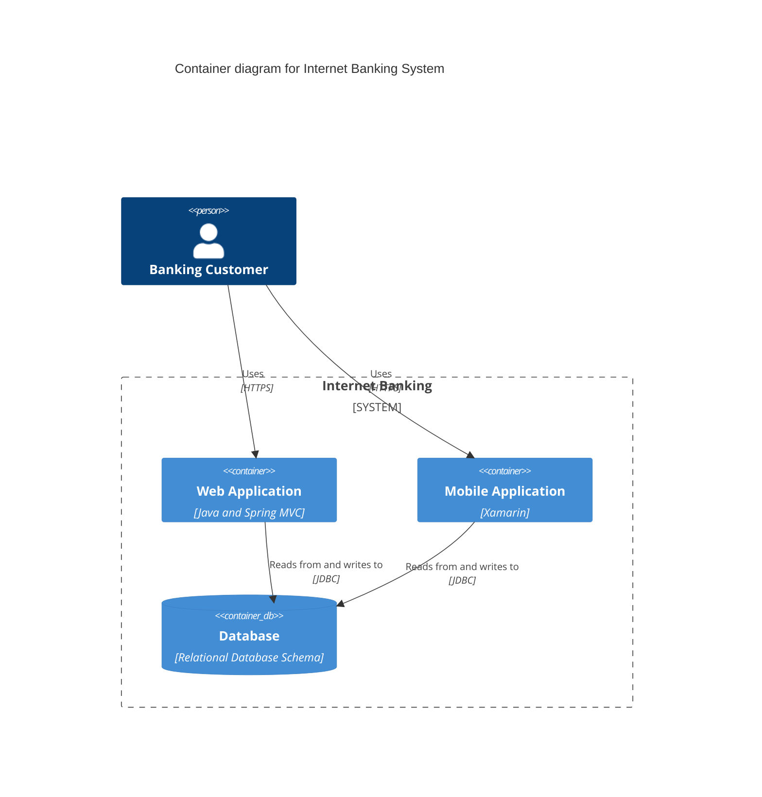
```mermaid
C4Container
    title Container diagram for Internet Banking System
    Person(customer, "Banking Customer")
    System_Boundary(c1, "Internet Banking") {
        Container(web_app, "Web Application", "Java and Spring MVC")
        Container(mobile_app, "Mobile Application", "Xamarin")
        ContainerDb(database, "Database", "Relational Database Schema")
    }
    Rel(customer, web_app, "Uses", "HTTPS")
    Rel(customer, mobile_app, "Uses", "HTTPS")
    Rel(web_app, database, "Reads from and writes to", "JDBC")
    Rel(mobile_app, database, "Reads from and writes to", "JDBC")
```

### 8.4. C4 Component

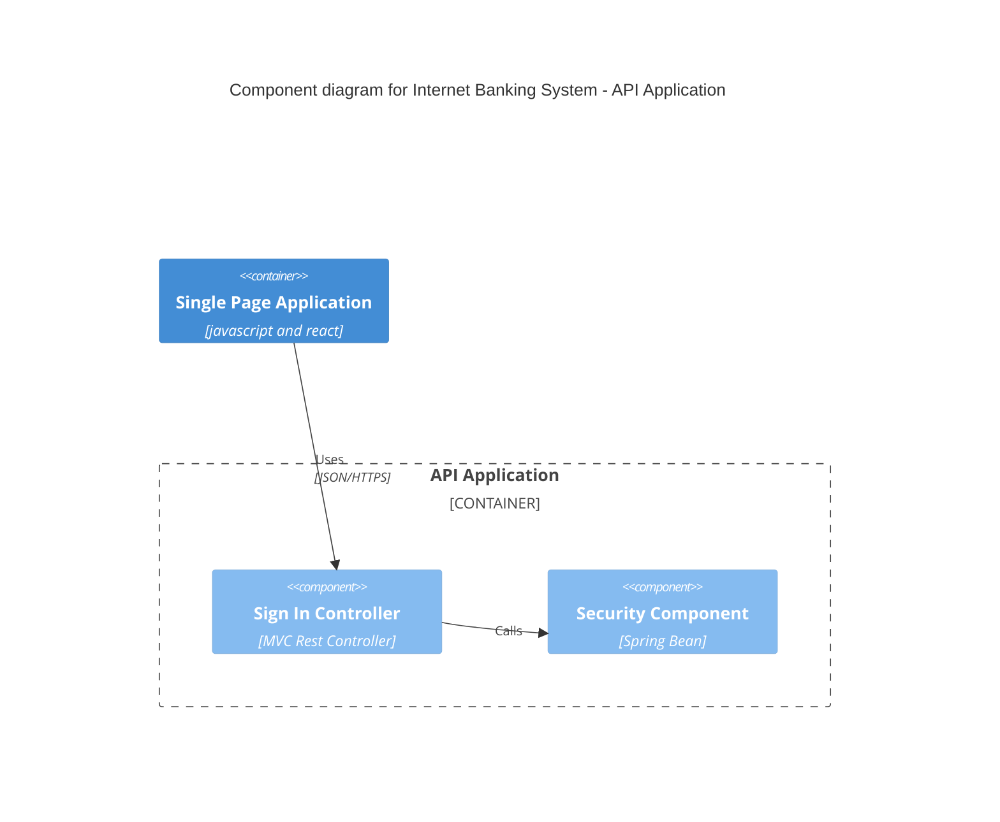
```mermaid
C4Component
    title Component diagram for Internet Banking System - API Application
    Container(spa, "Single Page Application", "javascript and react")
    Container_Boundary(api, "API Application") {
        Component(sign_in, "Sign In Controller", "MVC Rest Controller")
        Component(security, "Security Component", "Spring Bean")
    }
    Rel(spa, sign_in, "Uses", "JSON/HTTPS")
    Rel(sign_in, security, "Calls")
```

### 8.5. C4 Dynamic

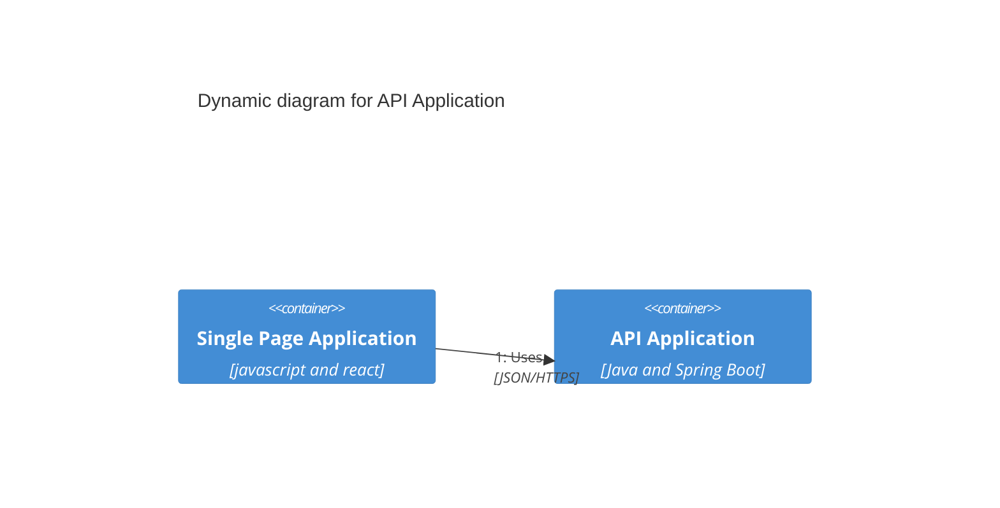
```mermaid
C4Dynamic
    title Dynamic diagram for API Application
    Container(spa, "Single Page Application", "javascript and react")
    Container(api, "API Application", "Java and Spring Boot")
    Rel(spa, api, "Uses", "JSON/HTTPS")
```

### 8.6. C4 Deployment

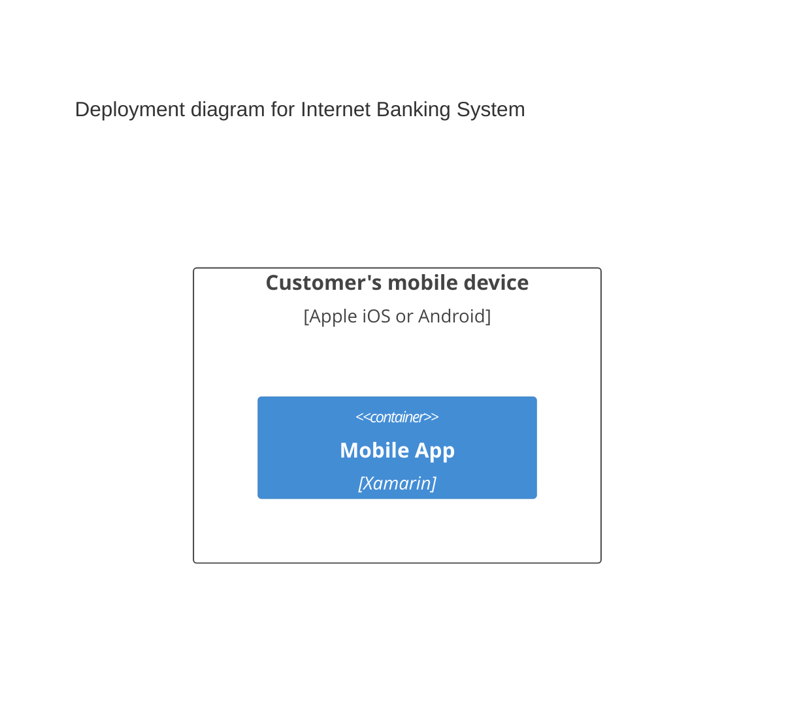
```mermaid
C4Deployment
    title Deployment diagram for Internet Banking System
    Deployment_Node(mob, "Customer's mobile device", "Apple iOS or Android") {
        Container(mobile, "Mobile App", "Xamarin")
    }
```

## 9. Architecture Diagram

### 9.1. Architecture Diagram (Simple)

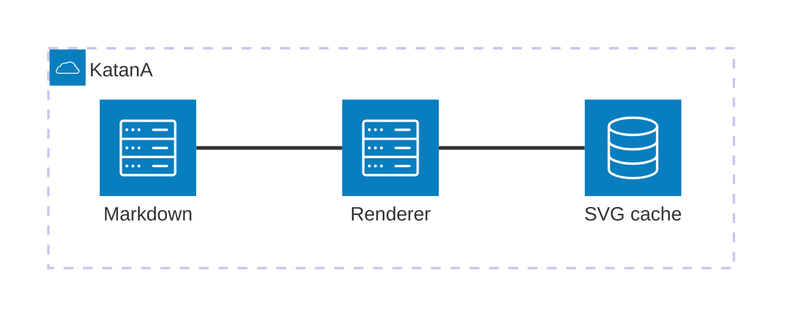
```mermaid
architecture-beta
    group app(cloud)[KatanA]
    service markdown(server)[Markdown] in app
    service renderer(server)[Renderer] in app
    service svg(database)[SVG cache] in app
    markdown:R -- L:renderer
    renderer:R -- L:svg
```

### 9.2. Architecture Diagram (Multi-service)

```mermaid
architecture-beta
    group api(cloud)[API]

    service db(database)[Database] in api
    service disk1(disk)[Storage] in api
    service disk2(disk)[Storage] in api
    service server(server)[Server] in api

    db:L -- R:server
    disk1:T -- B:server
    disk2:T -- B:db
```

## 10. Block Diagram

### 10.1. Block Diagram (Horizontal)

```mermaid
block-beta
    columns 3
    source["Markdown"] parser["Parser"] renderer["Renderer"]
    source --> parser
    parser --> renderer
```

### 10.2. Block Diagram (Vertical)

```mermaid
block-beta
columns 1
  db(("DB"))
  blockArrowId6<["&nbsp;&nbsp;&nbsp;"]>(down)
  block:ID
    A
    B["A wide one in the middle"]
    C
  end
  space
  D
  ID --> D
  C --> D
  style B fill:#969,stroke:#333,stroke-width:4px
```

## 11. Gantt Chart

### 11.1. Gantt Chart (Status colors)

```mermaid
gantt
    title Mermaid renderer schedule
    dateFormat YYYY-MM-DD
    todayMarker off
    section Spike
    DOM shim: done, 2026-04-01, 7d
    section Integration
    Production path: active, 2026-04-08, 14d
```

### 11.2. Gantt Chart (Sections)

```mermaid
gantt
    title A Gantt Diagram
    dateFormat  YYYY-MM-DD
    section Section
    A task           :a1, 2014-01-01, 30d
    Another task     :after a1  , 20d
    section Another
    Task in sec      :2014-01-12  , 12d
    another task      : 24d
```

## 12. Git Graph

### 12.1. Git Graph (Simple)

```mermaid
gitGraph
    commit id: "base"
    branch feature
    checkout feature
    commit id: "rust-js"
    checkout main
    merge feature
```

### 12.2. Git Graph (Multi-branch)

```mermaid
gitGraph
    commit
    branch develop
    checkout develop
    commit
    commit
    checkout main
    merge develop
    commit
    branch feature
    checkout feature
    commit
    commit
    checkout main
    merge feature
```

## 13. Ishikawa Diagram

### 13.1. Ishikawa Diagram (3 categories)

```mermaid
ishikawa-beta
  Diagram quality
    Runtime
      DOM API
      SVG API
    Layout
      Text measurement
      ViewBox
    Color
      Theme
      Background
```

### 13.2. Ishikawa Diagram (4 categories)

```mermaid
ishikawa-beta
    Blurry Photo
    Process
        Out of focus
        Shutter speed too slow
        Protective film not removed
        Beautification filter applied
    User
        Shaky hands
    Equipment
        LENS
            Inappropriate lens
            Damaged lens
            Dirty lens
        SENSOR
            Damaged sensor
            Dirty sensor
    Environment
        Subject moved too quickly
        Too dark
```

## 14. Kanban

### 14.1. Kanban (Simple)

```mermaid
kanban
    Todo
      [export runtime]
    Doing
      [Rust-managed Mermaid]
    Done
      [Remove OS Chrome path]
```

### 14.2. Kanban (Full)

```mermaid
---
config:
  kanban:
    ticketBaseUrl: 'https://github.com/mermaid-js/mermaid/issues/#TICKET#'
---
kanban
  Todo
    [Create Documentation]
    docs[Create Blog about the new diagram]
  [In progress]
    id6[Create renderer so that it works in all cases. We also add some extra text here for testing purposes. And some more just for the extra flare.]
  id9[Ready for deploy]
    id8[Design grammar]@{ assigned: 'knsv' }
  id10[Ready for test]
    id4[Create parsing tests]@{ ticket: 2038, assigned: 'K.Sveidqvist', priority: 'High' }
    id66[last item]@{ priority: 'Very Low', assigned: 'knsv' }
  id11[Done]
    id5[define getData]
    id2[Title of diagram is more than 100 chars when user duplicates diagram with 100 char]@{ ticket: 2036, priority: 'Very High'}
    id3[Update DB function]@{ ticket: 2037, assigned: knsv, priority: 'High' }

  id12[Can't reproduce]
    id3[Weird flickering in Firefox]
```

## 15. Packet Diagram

### 15.1. Packet Beta (Short)

```mermaid
packet-beta
0-15: "source hash"
16-31: "theme"
32-63: "renderer profile"
```

### 15.2. Packet (Full TCP)

```mermaid
---
title: "TCP Packet"
---
packet
0-15: "Source Port"
16-31: "Destination Port"
32-63: "Sequence Number"
64-95: "Acknowledgment Number"
96-99: "Data Offset"
100-105: "Reserved"
106: "URG"
107: "ACK"
108: "PSH"
109: "RST"
110: "SYN"
111: "FIN"
112-127: "Window"
128-143: "Checksum"
144-159: "Urgent Pointer"
160-191: "(Options and Padding)"
192-255: "Data (variable length)"
```

## 16. Pie Chart

### 16.1. Pie Chart (Rendering ownership)

```mermaid
pie title Rendering ownership
    "Rust-managed JS" : 70
    "SVG rasterize" : 20
    "Export runtime" : 10
```

### 16.2. Pie Chart (Pets)

```mermaid
pie title Pets adopted by volunteers
    "Dogs" : 386
    "Cats" : 85
    "Rats" : 15
```

## 17. Quadrant Chart

### 17.1. Quadrant Chart (Simple)

```mermaid
quadrantChart
    title Runtime evaluation
    x-axis Slow --> Fast
    y-axis OS dependent --> OS independent
    quadrant-1 Candidate
    quadrant-2 Needs work
    quadrant-3 Rejected
    quadrant-4 Overkill
    Rust-managed JS: [0.82, 0.86]
    OS Chrome: [0.35, 0.20]
```

### 17.2. Quadrant Chart (Campaigns)

```mermaid
quadrantChart
    title Reach and engagement of campaigns
    x-axis Low Reach --> High Reach
    y-axis Low Engagement --> High Engagement
    quadrant-1 We should expand
    quadrant-2 Need to promote
    quadrant-3 Re-evaluate
    quadrant-4 May be improved
    Campaign A: [0.3, 0.6]
    Campaign B: [0.45, 0.23]
    Campaign C: [0.57, 0.69]
    Campaign D: [0.78, 0.34]
    Campaign E: [0.40, 0.34]
    Campaign F: [0.35, 0.78]
```

## 18. Radar Chart

### 18.1. Radar Chart (4 axes)

```mermaid
radar-beta
    title Mermaid runtime
    axis Speed, Accuracy, Portability, Maintainability
    curve Current {4, 4, 5, 3}
    curve Target {5, 5, 5, 4}
    max 5
```

### 18.2. Radar Chart (6 axes)

```mermaid
---
title: "Grades"
---
radar-beta
  axis m["Math"], s["Science"], e["English"]
  axis h["History"], g["Geography"], a["Art"]
  curve a["Alice"]{85, 90, 80, 70, 75, 90}
  curve b["Bob"]{70, 75, 85, 80, 90, 85}

  max 100
  min 0
```

## 19. Requirement Diagram

### 19.1. Requirement Diagram (Single)

```mermaid
requirementDiagram

    requirement test_req {
    id: 1
    text: the test text.
    risk: high
    verifymethod: test
    }

    element test_entity {
    type: simulation
    }

    test_entity - satisfies -> test_req
```

### 19.2. Requirement Diagram (Multi)

```mermaid
requirementDiagram
    requirement independent_runtime {
        id: R1
        text: OS independent runtime
        risk: high
        verifymethod: test
    }
    requirement accurate_rendering {
        id: R2
        text: Fast accurate rendering
        risk: high
        verifymethod: inspection
    }
    independent_runtime - satisfies -> accurate_rendering
```

## 20. Sankey

### 20.1. Sankey (Simple)

```mermaid
sankey-beta
Markdown,Parser,10
Parser,Mermaid,4
Parser,HTML,6
Mermaid,SVG,4
SVG,Preview,4
```

### 20.2. Sankey (Large)

```mermaid
---
config:
  sankey:
    showValues: false
---
sankey-beta

Agricultural 'waste',Bio-conversion,124.729
Bio-conversion,Liquid,0.597
Bio-conversion,Losses,26.862
Bio-conversion,Solid,280.322
Bio-conversion,Gas,81.144
Biofuel imports,Liquid,35
Biomass imports,Solid,35
Coal imports,Coal,11.606
Coal reserves,Coal,63.965
Coal,Solid,75.571
District heating,Industry,10.639
District heating,Heating and cooling - commercial,22.505
District heating,Heating and cooling - homes,46.184
Electricity grid,Over generation / exports,104.453
Electricity grid,Heating and cooling - homes,113.726
Electricity grid,H2 conversion,27.14
Electricity grid,Industry,342.165
Electricity grid,Road transport,37.797
Electricity grid,Agriculture,4.412
Electricity grid,Heating and cooling - commercial,40.858
Electricity grid,Losses,56.691
Electricity grid,Rail transport,7.863
Electricity grid,Lighting & appliances - commercial,90.008
Electricity grid,Lighting & appliances - homes,93.494
Gas imports,NGas,40.719
Gas reserves,NGas,82.233
Gas,Heating and cooling - commercial,0.129
Gas,Losses,1.401
Gas,Thermal generation,151.891
Gas,Agriculture,2.096
Gas,Industry,48.58
Geothermal,Electricity grid,7.013
H2 conversion,H2,20.897
H2 conversion,Losses,6.242
H2,Road transport,20.897
Hydro,Electricity grid,6.995
Liquid,Industry,121.066
Liquid,International shipping,128.69
Liquid,Road transport,135.835
Liquid,Domestic aviation,14.458
Liquid,International aviation,206.267
Liquid,Agriculture,3.64
Liquid,National navigation,33.218
Liquid,Rail transport,4.413
Marine algae,Bio-conversion,4.375
NGas,Gas,122.952
Nuclear,Thermal generation,839.978
Oil imports,Oil,504.287
Oil reserves,Oil,107.703
Oil,Liquid,611.99
Other waste,Solid,56.587
Other waste,Bio-conversion,77.81
Pumped heat,Heating and cooling - homes,193.026
Pumped heat,Heating and cooling - commercial,70.672
Solar PV,Electricity grid,59.901
Solar Thermal,Heating and cooling - homes,19.263
Solar,Solar Thermal,19.263
Solar,Solar PV,59.901
Solid,Agriculture,0.882
Solid,Thermal generation,400.12
Solid,Industry,46.477
Thermal generation,Electricity grid,525.531
Thermal generation,Losses,787.129
Thermal generation,District heating,79.329
Tidal,Electricity grid,9.452
UK land based bioenergy,Bio-conversion,182.01
Wave,Electricity grid,19.013
Wind,Electricity grid,289.366
```

## 21. Timeline

### 21.1. Timeline (Phases)

```mermaid
timeline
    title Mermaid runtime adoption
    Spike : DOM shim
          : SVG generation
    Integration : Preview path
                : Cache profile
    Review : Fixture coverage
           : Performance check
```

### 21.2. Timeline (History)

```mermaid
timeline
    title History of Social Media Platform
    2002 : LinkedIn
    2004 : Facebook
         : Google
    2005 : YouTube
    2006 : Twitter
```

## 22. Tree View

### 22.1. Tree View (Simple)

```mermaid
treeView-beta
    "Root"
        "Runtime"
            "V8"
            "DOM shim"
        "Output"
            "SVG"
            "Rasterize"
```

### 22.2. Tree View (File system)

```mermaid
treeView-beta
            "docs"
                "build"
                "justfile"
                "Justfile"
                "out"
                "source"
                    "build"
                    "static"
                        "_templates"
                        "div. Files"
```

## 23. Treemap

### 23.1. Treemap (Flat)

```mermaid
treemap
    title Runtime cost
    "Mermaid" : 45
    "DOM shim" : 25
    "Rasterize" : 20
    "Cache" : 10
```

### 23.2. Treemap Beta (Nested)

```mermaid
treemap-beta
"Section 1"
    "Leaf 1.1": 12
    "Section 1.2"
      "Leaf 1.2.1": 12
"Section 2"
    "Leaf 2.1": 20
    "Leaf 2.2": 25
```

## 24. User Journey

### 24.1. User Journey (Diagram preview)

```mermaid
journey
    title Diagram preview
    section Edit
      Write Markdown: 5: User
      Check diagram: 4: User, KatanA
    section Export
      Export to HTML: 3: KatanA
```

### 24.2. User Journey (Working day)

```mermaid
journey
    title My working day
    section Go to work
      Make tea: 5: Me
      Go upstairs: 3: Me
      Do work: 1: Me, Cat
    section Go home
      Go downstairs: 5: Me
      Sit down: 5: Me
```

## 25. Venn Diagram

### 25.1. Venn Diagram (2 sets)

```mermaid
venn-beta
    title Renderer scope
    set official ["Official Mermaid.js"]: 40
    set rust ["Rust-managed runtime"]: 35
    union official, rust: 25
```

### 25.2. Venn Diagram (3 sets with styles)

```mermaid
venn-beta
    title "Three overlapping sets"
    set A
    set B
    set C
    union A,B["AB"]
    union B,C["BC"]
    union A,C["AC"]
    union A,B,C["ABC"]
    style A,B fill:skyblue
    style B,C fill:orange
    style A,C fill:lightgreen
    style A,B,C fill:white, color:red
```

## 26. Wardley Map

### 26.1. Wardley Map (Simple)

```mermaid
wardley-beta
    title Renderer adoption
    anchor User [0.95, 0.62]
    component Preview [0.78, 0.55]
    component MermaidJS [0.62, 0.42]
    component DOMShim [0.38, 0.35]
    User->Preview
    Preview->MermaidJS
    MermaidJS->DOMShim
```

### 26.2. Wardley Map (Full with notes)

```mermaid
wardley-beta
title Tea Shop
size [1100, 800]

anchor Business [0.95, 0.63]
anchor Public [0.95, 0.78]
component Cup of Tea [0.79, 0.61] label [19, -4]
component Cup [0.73, 0.78]
component Tea [0.63, 0.81]
component Hot Water [0.52, 0.80]
component Water [0.38, 0.82]
component Kettle [0.43, 0.35] label [-57, 4]
component Power [0.1, 0.7] label [-27, 20]

Business -> Cup of Tea
Public -> Cup of Tea
Cup of Tea -> Cup
Cup of Tea -> Tea
Cup of Tea -> Hot Water
Hot Water -> Water
Hot Water -> Kettle
Kettle -> Power

evolve Kettle 0.62
evolve Power 0.89

note "Standardising power allows Kettles to evolve faster" [0.30, 0.49]
note "Hot water is obvious and well known" [0.48, 0.80]
note "A generic note appeared" [0.23, 0.33]
```

## 27. XY Chart

### 27.1. XY Chart (Line only)

```mermaid
xychart-beta
    title "Render time"
    x-axis [1, 2, 3, 4]
    y-axis "ms" 0 --> 100
    line [80, 62, 48, 42]
```

### 27.2. XY Chart (Bar + Line)

```mermaid
xychart-beta
    title "Sales Revenue"
    x-axis [jan, feb, mar, apr, may, jun, jul, aug, sep, oct, nov, dec]
    y-axis "Revenue (in $)" 4000 --> 11000
    bar [5000, 6000, 7500, 8200, 9500, 10500, 11000, 10200, 9200, 8500, 7000, 6000]
    line [5000, 6000, 7500, 8200, 9500, 10500, 11000, 10200, 9200, 8500, 7000, 6000]
```

## 28. ZenUML

```mermaid
zenuml
    title Order Service
    @Actor Client #FFEBE6
    @Boundary OrderController #0747A6
    @EC2 <<BFF>> OrderService #E3FCEF
    group BusinessService {
      @Lambda PurchaseService
      @AzureFunction InvoiceService
    }

    @Starter(Client)
    // `POST /orders`
    OrderController.post(payload) {
      OrderService.create(payload) {
        order = new Order(payload)
        if(order != null) {
          par {
            PurchaseService.createPO(order)
            InvoiceService.createInvoice(order)
          }
        }
      }
    }
```

## 29. Empty

```mermaid
```
