# Mermaid サンプル図表

このフィクスチャはサポート対象の全 Mermaid 図表タイプを検証するためのものです。

---

## 1. フローチャート

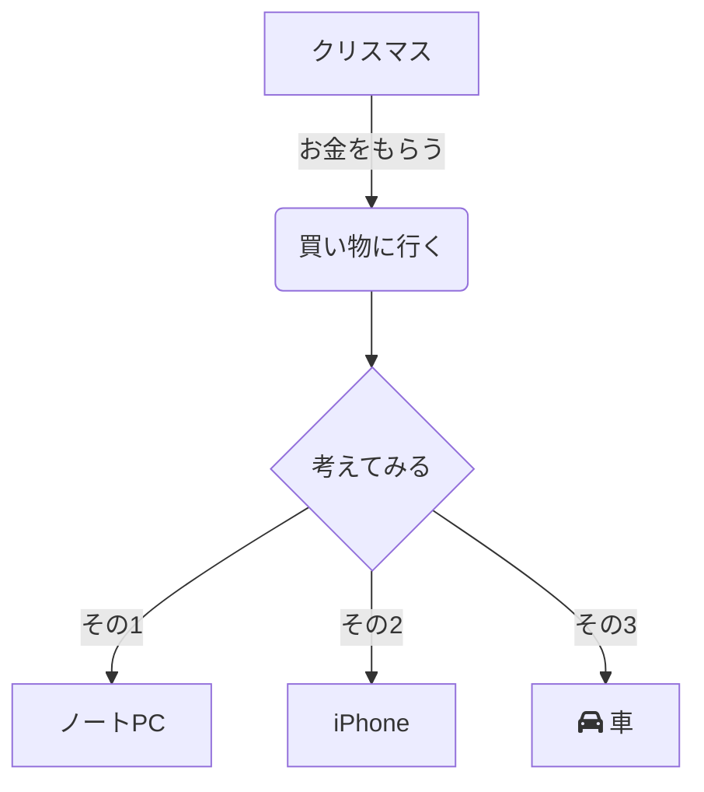
```mermaid
flowchart TD
    A[クリスマス] -->|お金をもらう| B(買い物に行く)
    B --> C{考えてみる}
    C -->|その1| D[ノートPC]
    C -->|その2| E[iPhone]
    C -->|その3| F[fa:fa-car 車]
```

## 2. グラフ

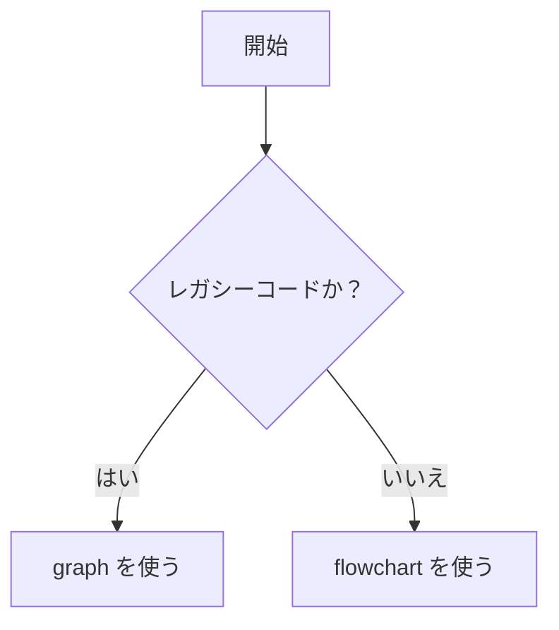
```mermaid
graph TD
    A[開始] --> B{レガシーコードか？}
    B -- はい --> C[graph を使う]
    B -- いいえ --> D[flowchart を使う]
```

## 3. クラス図

### 3.1. クラス図（列挙型）

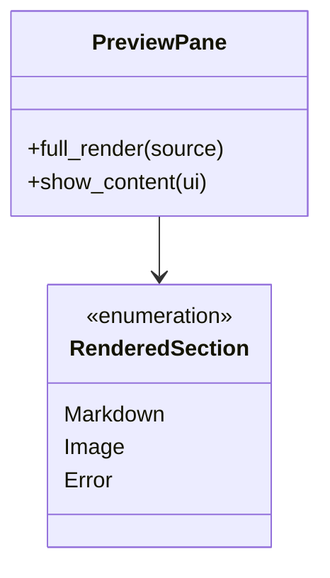
```mermaid
classDiagram
    class PreviewPane {
        +full_render(source)
        +show_content(ui)
    }
    class RenderedSection {
        <<enumeration>>
        Markdown
        Image
        Error
    }
    PreviewPane --> RenderedSection
```

### 3.2. クラス図（継承）

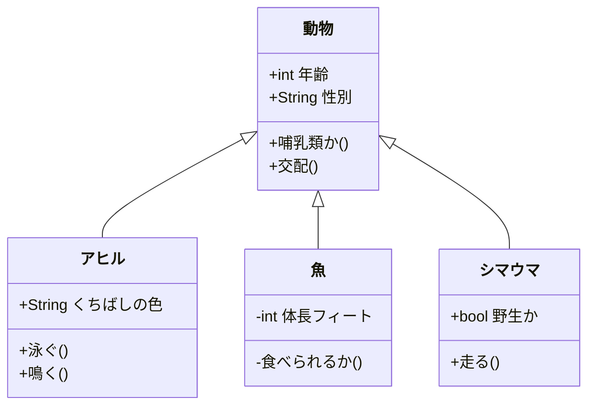
```mermaid
classDiagram
    動物 <|-- アヒル
    動物 <|-- 魚
    動物 <|-- シマウマ
    動物 : +int 年齢
    動物 : +String 性別
    動物: +哺乳類か()
    動物: +交配()
    class アヒル{
      +String くちばしの色
      +泳ぐ()
      +鳴く()
    }
    class 魚{
      -int 体長フィート
      -食べられるか()
    }
    class シマウマ{
      +bool 野生か
      +走る()
    }
```

## 4. シーケンス図

### 4.1. シーケンス図（シンプル）

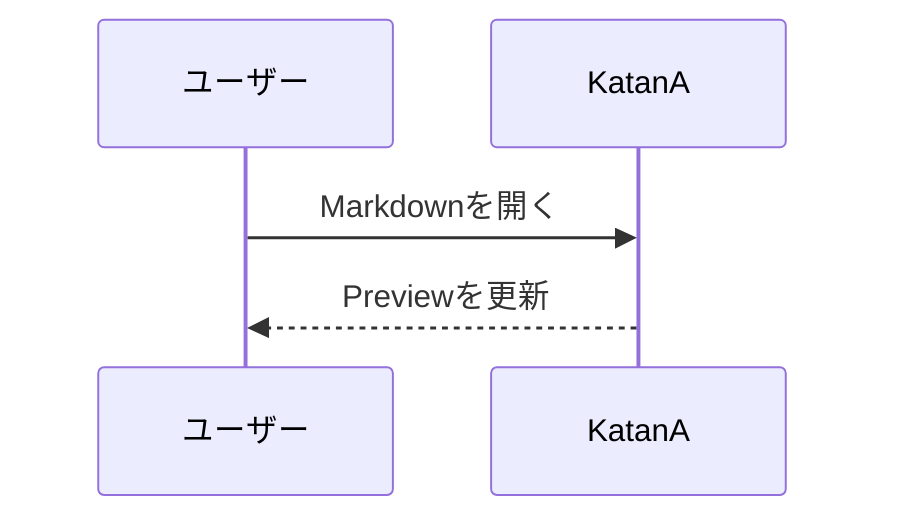
```mermaid
sequenceDiagram
    participant User as ユーザー
    participant App as KatanA
    User->>App: Markdownを開く
    App-->>User: Previewを更新
```

### 4.2. シーケンス図（アクティベーション）

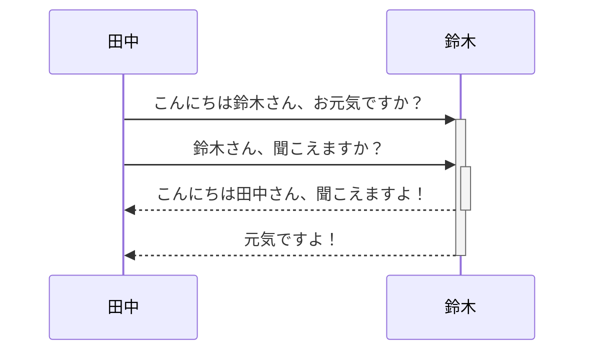
```mermaid
sequenceDiagram
    田中->>+鈴木: こんにちは鈴木さん、お元気ですか？
    田中->>+鈴木: 鈴木さん、聞こえますか？
    鈴木-->>-田中: こんにちは田中さん、聞こえますよ！
    鈴木-->>-田中: 元気ですよ！
```

## 5. ER図

### 5.1. ER図（シンプル）

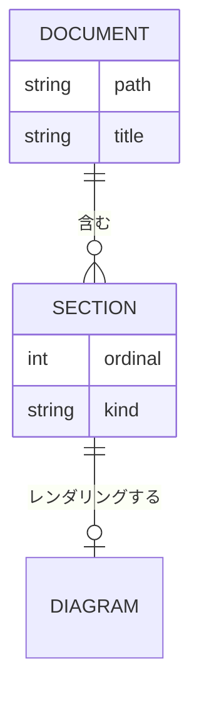
```mermaid
erDiagram
    DOCUMENT ||--o{ SECTION : "含む"
    SECTION ||--o| DIAGRAM : "レンダリングする"
    DOCUMENT {
        string path
        string title
    }
    SECTION {
        int ordinal
        string kind
    }
```

### 5.2. ER図（複数エンティティ）

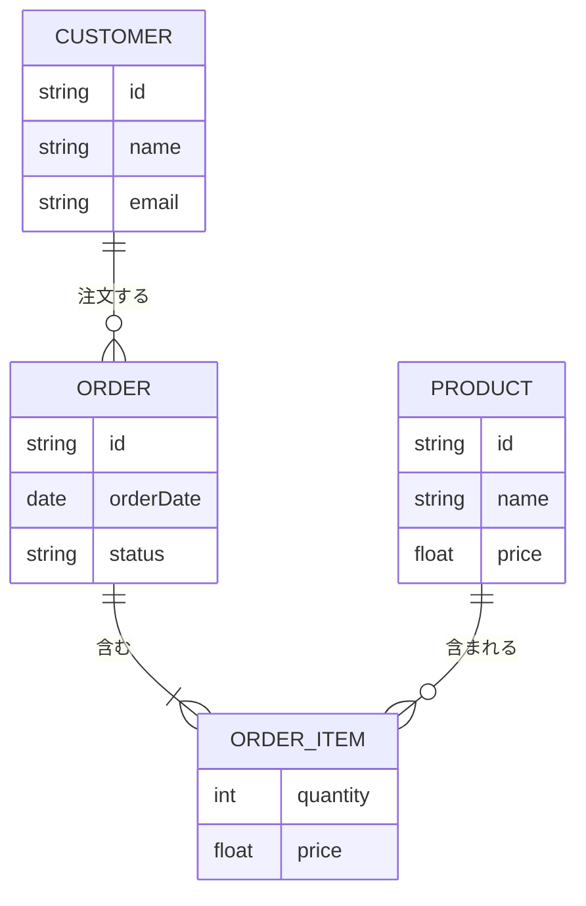
```mermaid
erDiagram
    CUSTOMER ||--o{ ORDER : "注文する"
    ORDER ||--|{ ORDER_ITEM : "含む"
    PRODUCT ||--o{ ORDER_ITEM : "含まれる"
    CUSTOMER {
        string id
        string name
        string email
    }
    ORDER {
        string id
        date orderDate
        string status
    }
    PRODUCT {
        string id
        string name
        float price
    }
    ORDER_ITEM {
        int quantity
        float price
    }
```

## 6. 状態遷移図

### 6.1. 状態遷移図 v2（失敗パス）

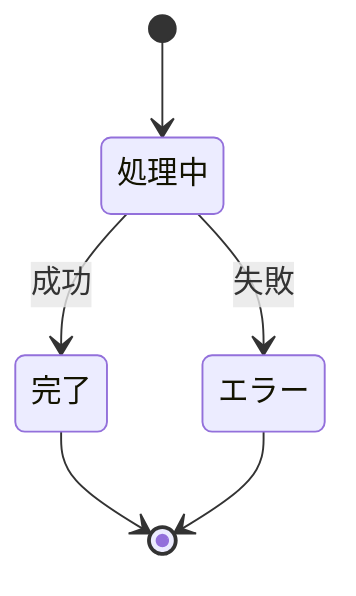
```mermaid
stateDiagram-v2
    [*] --> 処理中
    処理中 --> 完了 : 成功
    処理中 --> エラー : 失敗
    完了 --> [*]
    エラー --> [*]
```

### 6.2. 状態遷移図 v2

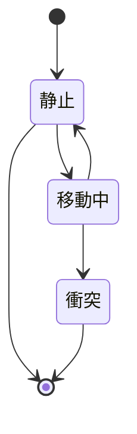
```mermaid
stateDiagram-v2
    [*] --> 静止
    静止 --> [*]
    静止 --> 移動中
    移動中 --> 静止
    移動中 --> 衝突
    衝突 --> [*]
```

### 6.3. 状態遷移図 v1


```mermaid
stateDiagram
    [*] --> 静止
    静止 --> [*]
    静止 --> 移動中
    移動中 --> 静止
    移動中 --> 衝突
    衝突 --> [*]
```

## 7. マインドマップ

### 7.1. マインドマップ（シンプル）

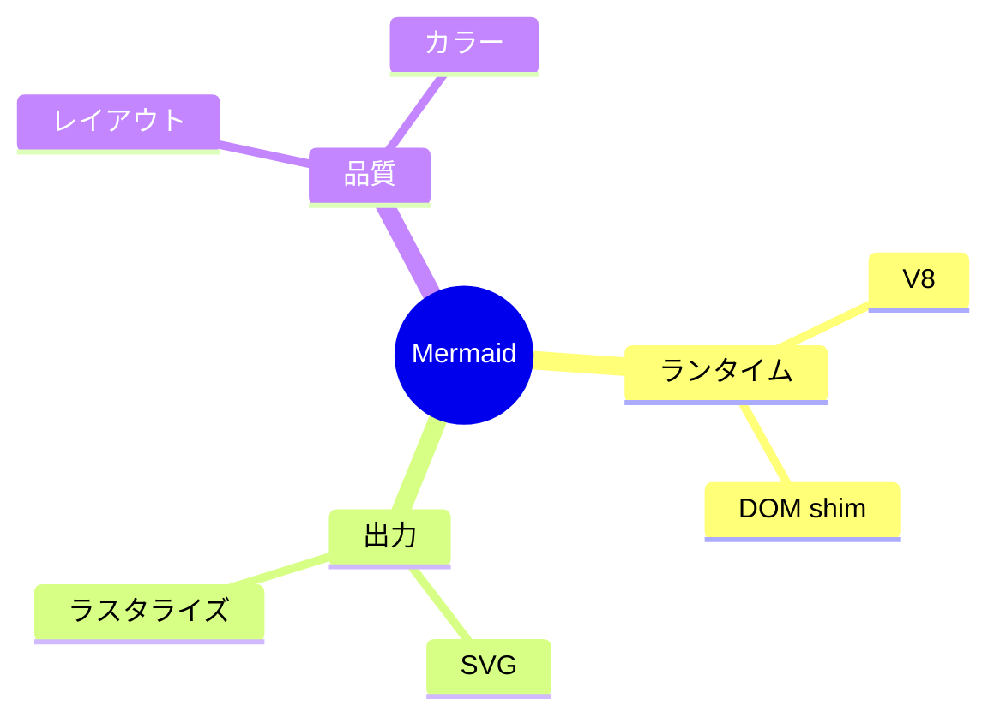
```mermaid
mindmap
  root((Mermaid))
    ランタイム
      V8
      DOM shim
    出力
      SVG
      ラスタライズ
    品質
      レイアウト
      カラー
```

### 7.2. マインドマップ（アイコン付き）

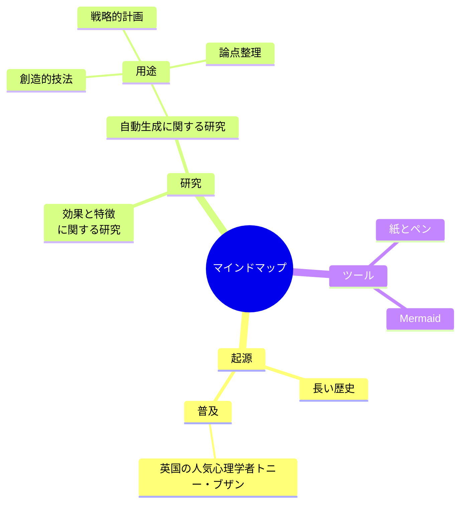
```mermaid
mindmap
  root((マインドマップ))
    起源
      長い歴史
      ::icon(fa fa-book)
      普及
        英国の人気心理学者トニー・ブザン
    研究
      効果と特徴<br/>に関する研究
      自動生成に関する研究
        用途
            創造的技法
            戦略的計画
            論点整理
    ツール
      紙とペン
      Mermaid
```

## 8. C4

### 8.1. C4 コンテキスト（シンプル）

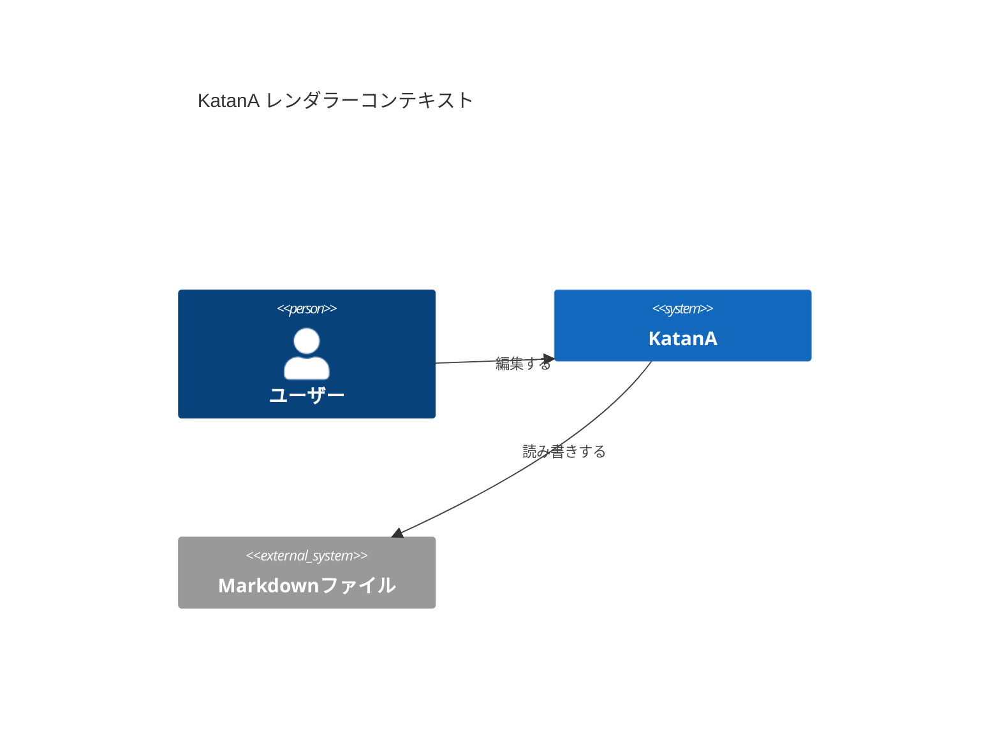
```mermaid
C4Context
    title KatanA レンダラーコンテキスト
    Person(user, "ユーザー")
    System(katana, "KatanA")
    System_Ext(files, "Markdownファイル")
    Rel(user, katana, "編集する")
    Rel(katana, files, "読み書きする")
```

### 8.2. C4 コンテキスト（フル）

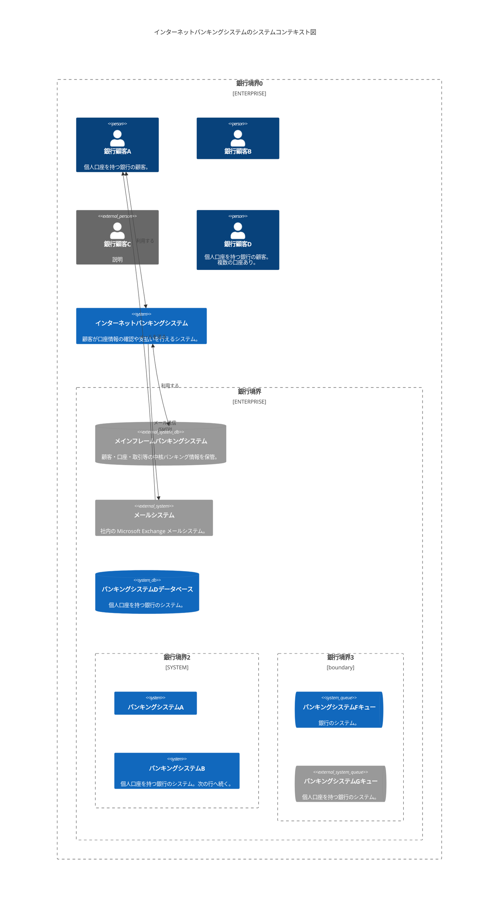
```mermaid
C4Context
    title インターネットバンキングシステムのシステムコンテキスト図
    Enterprise_Boundary(b0, "銀行境界0") {
        Person(customerA, "銀行顧客A", "個人口座を持つ銀行の顧客。")
        Person(customerB, "銀行顧客B")
        Person_Ext(customerC, "銀行顧客C", "説明")

        Person(customerD, "銀行顧客D", "個人口座を持つ銀行の顧客。<br/> 複数の口座あり。")

        System(SystemAA, "インターネットバンキングシステム", "顧客が口座情報の確認や支払いを行えるシステム。")

        Enterprise_Boundary(b1, "銀行境界") {
            SystemDb_Ext(SystemE, "メインフレームバンキングシステム", "顧客・口座・取引等の中核バンキング情報を保管。")

            System_Boundary(b2, "銀行境界2") {
                System(SystemA, "バンキングシステムA")
                System(SystemB, "バンキングシステムB", "個人口座を持つ銀行のシステム。次の行へ続く。")
            }

            System_Ext(SystemC, "メールシステム", "社内の Microsoft Exchange メールシステム。")
            SystemDb(SystemD, "バンキングシステムDデータベース", "個人口座を持つ銀行のシステム。")

            Boundary(b3, "銀行境界3", "boundary") {
                SystemQueue(SystemF, "バンキングシステムFキュー", "銀行のシステム。")
                SystemQueue_Ext(SystemG, "バンキングシステムGキュー", "個人口座を持つ銀行のシステム。")
            }
        }
    }

    BiRel(customerA, SystemAA, "利用する")
    BiRel(SystemAA, SystemE, "利用する")
    Rel(SystemAA, SystemC, "メール送信", "SMTP")
    Rel(SystemC, customerA, "メールを送る")
```

### 8.3. C4 コンテナ

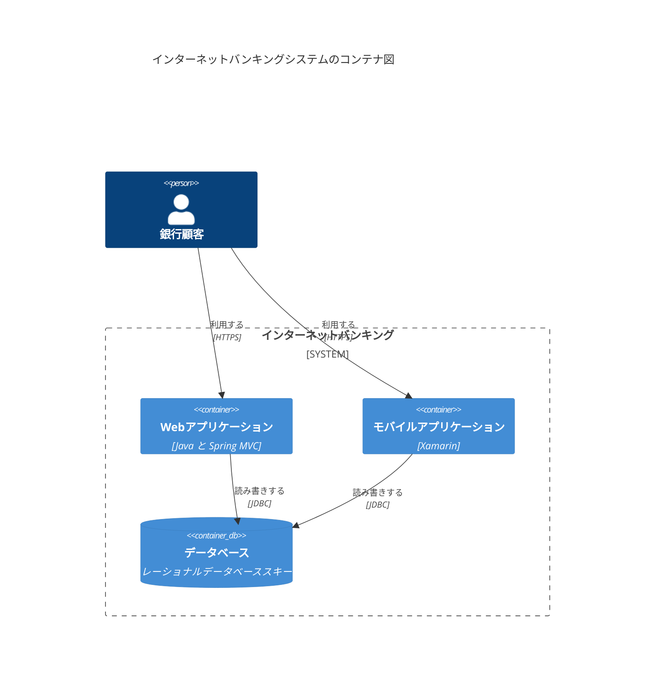
```mermaid
C4Container
    title インターネットバンキングシステムのコンテナ図
    Person(customer, "銀行顧客")
    System_Boundary(c1, "インターネットバンキング") {
        Container(web_app, "Webアプリケーション", "Java と Spring MVC")
        Container(mobile_app, "モバイルアプリケーション", "Xamarin")
        ContainerDb(database, "データベース", "リレーショナルデータベーススキーマ")
    }
    Rel(customer, web_app, "利用する", "HTTPS")
    Rel(customer, mobile_app, "利用する", "HTTPS")
    Rel(web_app, database, "読み書きする", "JDBC")
    Rel(mobile_app, database, "読み書きする", "JDBC")
```

### 8.4. C4 コンポーネント

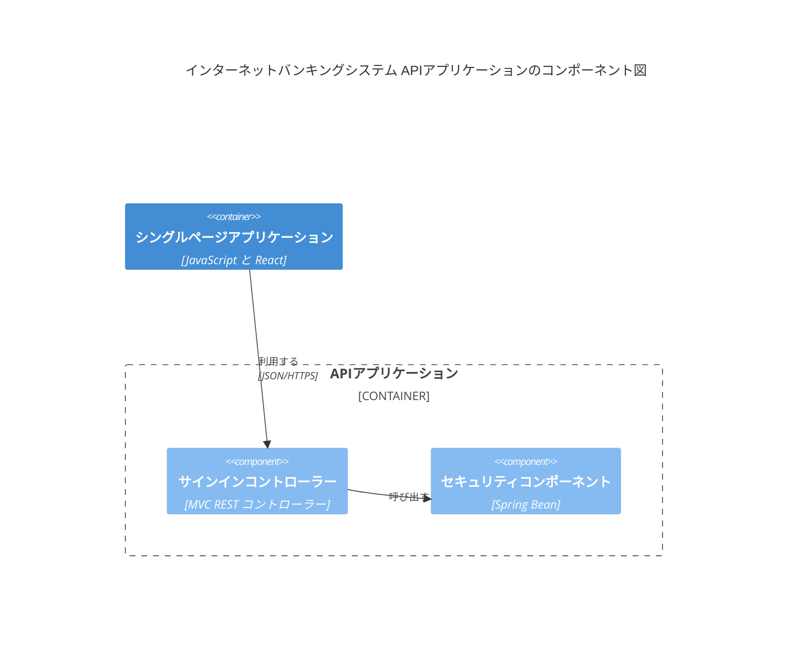
```mermaid
C4Component
    title インターネットバンキングシステム APIアプリケーションのコンポーネント図
    Container(spa, "シングルページアプリケーション", "JavaScript と React")
    Container_Boundary(api, "APIアプリケーション") {
        Component(sign_in, "サインインコントローラー", "MVC REST コントローラー")
        Component(security, "セキュリティコンポーネント", "Spring Bean")
    }
    Rel(spa, sign_in, "利用する", "JSON/HTTPS")
    Rel(sign_in, security, "呼び出す")
```

### 8.5. C4 ダイナミック

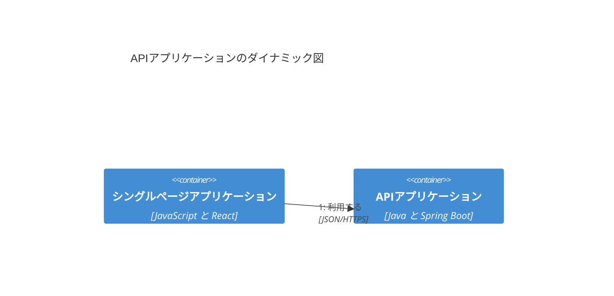
```mermaid
C4Dynamic
    title APIアプリケーションのダイナミック図
    Container(spa, "シングルページアプリケーション", "JavaScript と React")
    Container(api, "APIアプリケーション", "Java と Spring Boot")
    Rel(spa, api, "利用する", "JSON/HTTPS")
```

### 8.6. C4 デプロイメント

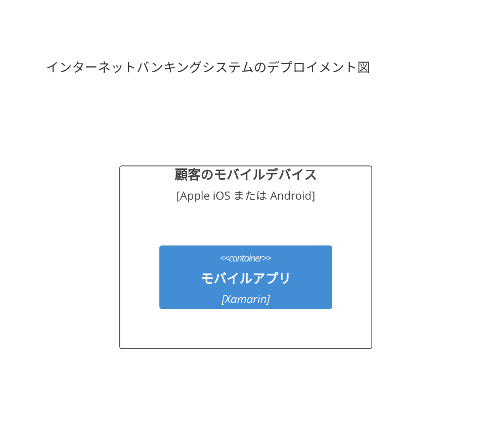
```mermaid
C4Deployment
    title インターネットバンキングシステムのデプロイメント図
    Deployment_Node(mob, "顧客のモバイルデバイス", "Apple iOS または Android") {
        Container(mobile, "モバイルアプリ", "Xamarin")
    }
```

## 9. アーキテクチャ図

### 9.1. アーキテクチャ図（シンプル）


```mermaid
architecture-beta
    group app(cloud)[KatanA]
    service markdown(server)[Markdown] in app
    service renderer(server)[レンダラー] in app
    service svg(database)[SVGキャッシュ] in app
    markdown:R -- L:renderer
    renderer:R -- L:svg
```

### 9.2. アーキテクチャ図（マルチサービス）

```mermaid
architecture-beta
    group api(cloud)[API]

    service db(database)[データベース] in api
    service disk1(disk)[ストレージ] in api
    service disk2(disk)[ストレージ] in api
    service server(server)[サーバー] in api

    db:L -- R:server
    disk1:T -- B:server
    disk2:T -- B:db
```

## 10. ブロック図

### 10.1. ブロック図（横方向）

```mermaid
block-beta
    columns 3
    source["Markdown"] parser["パーサー"] renderer["レンダラー"]
    source --> parser
    parser --> renderer
```

### 10.2. ブロック図（縦方向）

```mermaid
block-beta
columns 1
  db(("DB"))
  blockArrowId6<["&nbsp;&nbsp;&nbsp;"]>(down)
  block:ID
    A
    B["中央の広いブロック"]
    C
  end
  space
  D
  ID --> D
  C --> D
  style B fill:#969,stroke:#333,stroke-width:4px
```

## 11. ガントチャート

### 11.1. ガントチャート（ステータス色）

```mermaid
gantt
    title Mermaidレンダラースケジュール
    dateFormat YYYY-MM-DD
    todayMarker off
    section スパイク
    DOM shim: done, 2026-04-01, 7d
    section インテグレーション
    本番パス: active, 2026-04-08, 14d
```

### 11.2. ガントチャート（複数セクション）

```mermaid
gantt
    title ガントチャートの例
    dateFormat  YYYY-MM-DD
    section セクション
    タスクA           :a1, 2014-01-01, 30d
    タスクB           :after a1  , 20d
    section 別セクション
    タスクC           :2014-01-12  , 12d
    タスクD           : 24d
```

## 12. Gitグラフ

### 12.1. Gitグラフ（シンプル）

```mermaid
gitGraph
    commit id: "base"
    branch feature
    checkout feature
    commit id: "rust-js"
    checkout main
    merge feature
```

### 12.2. Gitグラフ（マルチブランチ）

```mermaid
gitGraph
    commit
    branch develop
    checkout develop
    commit
    commit
    checkout main
    merge develop
    commit
    branch feature
    checkout feature
    commit
    commit
    checkout main
    merge feature
```

## 13. 特性要因図

### 13.1. 特性要因図（3カテゴリ）

```mermaid
ishikawa-beta
  図表品質
    ランタイム
      DOM API
      SVG API
    レイアウト
      テキスト計測
      ViewBox
    カラー
      テーマ
      背景
```

### 13.2. 特性要因図（4カテゴリ）

```mermaid
ishikawa-beta
    ぼやけた写真
    工程
        ピントが合っていない
        シャッタースピードが遅すぎる
        保護フィルムが外れていない
        美化フィルターが適用されている
    ユーザー
        手ブレ
    機材
        レンズ
            不適切なレンズ
            損傷したレンズ
            汚れたレンズ
        センサー
            損傷したセンサー
            汚れたセンサー
    環境
        被写体の動きが速すぎる
        暗すぎる
```

## 14. カンバン

### 14.1. カンバン（シンプル）

```mermaid
kanban
    未着手
      [エクスポートランタイム]
    進行中
      [Rust管理Mermaid]
    完了
      [OS Chromeパス削除]
```

### 14.2. カンバン（フル）

```mermaid
---
config:
  kanban:
    ticketBaseUrl: 'https://github.com/mermaid-js/mermaid/issues/#TICKET#'
---
kanban
  未着手
    [ドキュメント作成]
    docs[新しい図表についてブログを書く]
  [進行中]
    id6[全ケースで動作するレンダラーを作成する。テスト用に追加テキストも含む。さらに補足情報も追加。]
  id9[デプロイ待ち]
    id8[文法を設計する]@{ assigned: 'knsv' }
  id10[テスト待ち]
    id4[パーステストを作成する]@{ ticket: 2038, assigned: 'K.Sveidqvist', priority: 'High' }
    id66[最後のアイテム]@{ priority: 'Very Low', assigned: 'knsv' }
  id11[完了]
    id5[getData を定義する]
    id2[100文字以上のタイトルを持つ図表を複製した場合のタイトル表示]@{ ticket: 2036, priority: 'Very High'}
    id3[DB関数を更新する]@{ ticket: 2037, assigned: knsv, priority: 'High' }

  id12[再現不可]
    id3[Firefoxでの奇妙なちらつき]
```

## 15. パケット図

### 15.1. パケット Beta（短い）

```mermaid
packet-beta
0-15: "ソースハッシュ"
16-31: "テーマ"
32-63: "レンダラープロファイル"
```

### 15.2. パケット（TCP フル）

```mermaid
---
title: "TCPパケット"
---
packet
0-15: "送信元ポート"
16-31: "宛先ポート"
32-63: "シーケンス番号"
64-95: "確認応答番号"
96-99: "データオフセット"
100-105: "予約済み"
106: "URG"
107: "ACK"
108: "PSH"
109: "RST"
110: "SYN"
111: "FIN"
112-127: "ウィンドウ"
128-143: "チェックサム"
144-159: "緊急ポインタ"
160-191: "(オプションとパディング)"
192-255: "データ（可変長）"
```

## 16. 円グラフ

### 16.1. 円グラフ（レンダリング所有権）

```mermaid
pie title レンダリング所有権
    "Rust管理JS" : 70
    "SVGラスタライズ" : 20
    "エクスポートランタイム" : 10
```

### 16.2. 円グラフ（ペット）

```mermaid
pie title ボランティアに引き取られたペット
    "犬" : 386
    "猫" : 85
    "ネズミ" : 15
```

## 17. 象限チャート

### 17.1. 象限チャート（シンプル）

```mermaid
quadrantChart
    title ランタイム評価
    x-axis 低速 --> 高速
    y-axis OS依存 --> OS非依存
    quadrant-1 候補
    quadrant-2 要改善
    quadrant-3 却下
    quadrant-4 過剰品質
    Rust管理JS: [0.82, 0.86]
    OS Chrome: [0.35, 0.20]
```

### 17.2. 象限チャート（キャンペーン）

```mermaid
quadrantChart
    title キャンペーンのリーチとエンゲージメント
    x-axis 低リーチ --> 高リーチ
    y-axis 低エンゲージメント --> 高エンゲージメント
    quadrant-1 拡大すべき
    quadrant-2 プロモーションが必要
    quadrant-3 再評価
    quadrant-4 改善の余地あり
    キャンペーンA: [0.3, 0.6]
    キャンペーンB: [0.45, 0.23]
    キャンペーンC: [0.57, 0.69]
    キャンペーンD: [0.78, 0.34]
    キャンペーンE: [0.40, 0.34]
    キャンペーンF: [0.35, 0.78]
```

## 18. レーダーチャート

### 18.1. レーダーチャート（4軸）

```mermaid
radar-beta
    title Mermaidランタイム
    axis Speed, Accuracy, Portability, Maintainability
    curve Current {4, 4, 5, 3}
    curve Target {5, 5, 5, 4}
    max 5
```

### 18.2. レーダーチャート（6軸）

```mermaid
---
title: "成績"
---
radar-beta
  axis m["数学"], s["理科"], e["英語"]
  axis h["歴史"], g["地理"], a["美術"]
  curve a["アリス"]{85, 90, 80, 70, 75, 90}
  curve b["ボブ"]{70, 75, 85, 80, 90, 85}

  max 100
  min 0
```

## 19. 要件図

### 19.1. 要件図（単一）

```mermaid
requirementDiagram

    requirement テスト要件 {
    id: 1
    text: テストのテキスト。
    risk: high
    verifymethod: test
    }

    element テストエンティティ {
    type: simulation
    }

    テストエンティティ - satisfies -> テスト要件
```

### 19.2. 要件図（複数）

```mermaid
requirementDiagram
    requirement independent_runtime {
        id: R1
        text: OSに依存しないランタイム
        risk: high
        verifymethod: test
    }
    requirement accurate_rendering {
        id: R2
        text: 高速かつ正確なレンダリング
        risk: high
        verifymethod: inspection
    }
    independent_runtime - satisfies -> accurate_rendering
```

## 20. サンキー図

### 20.1. サンキー図（シンプル）

```mermaid
sankey-beta
Markdown,パーサー,10
パーサー,Mermaid,4
パーサー,HTML,6
Mermaid,SVG,4
SVG,プレビュー,4
```

### 20.2. サンキー図（大規模）

```mermaid
---
config:
  sankey:
    showValues: false
---
sankey-beta

農業廃棄物,バイオ変換,124.729
バイオ変換,液体燃料,0.597
バイオ変換,損失,26.862
バイオ変換,固体燃料,280.322
バイオ変換,ガス,81.144
バイオ燃料輸入,液体燃料,35
バイオマス輸入,固体燃料,35
石炭輸入,石炭,11.606
石炭備蓄,石炭,63.965
石炭,固体燃料,75.571
地域熱供給,産業,10.639
地域熱供給,業務用冷暖房,22.505
地域熱供給,家庭用冷暖房,46.184
電力網,余剰発電・輸出,104.453
電力網,家庭用冷暖房,113.726
電力網,水素変換,27.14
電力網,産業,342.165
電力網,道路輸送,37.797
電力網,農業,4.412
電力網,業務用冷暖房,40.858
電力網,損失,56.691
電力網,鉄道輸送,7.863
電力網,業務用照明・家電,90.008
電力網,家庭用照明・家電,93.494
ガス輸入,天然ガス,40.719
ガス備蓄,天然ガス,82.233
ガス,業務用冷暖房,0.129
ガス,損失,1.401
ガス,火力発電,151.891
ガス,農業,2.096
ガス,産業,48.58
地熱,電力網,7.013
水素変換,水素,20.897
水素変換,損失,6.242
水素,道路輸送,20.897
水力,電力網,6.995
液体燃料,産業,121.066
液体燃料,国際海運,128.69
液体燃料,道路輸送,135.835
液体燃料,国内航空,14.458
液体燃料,国際航空,206.267
液体燃料,農業,3.64
液体燃料,国内航行,33.218
液体燃料,鉄道輸送,4.413
海藻,バイオ変換,4.375
天然ガス,ガス,122.952
原子力,火力発電,839.978
石油輸入,石油,504.287
石油備蓄,石油,107.703
石油,液体燃料,611.99
その他廃棄物,固体燃料,56.587
その他廃棄物,バイオ変換,77.81
ヒートポンプ,家庭用冷暖房,193.026
ヒートポンプ,業務用冷暖房,70.672
太陽光発電,電力網,59.901
太陽熱,家庭用冷暖房,19.263
太陽,太陽熱,19.263
太陽,太陽光発電,59.901
固体燃料,農業,0.882
固体燃料,火力発電,400.12
固体燃料,産業,46.477
火力発電,電力網,525.531
火力発電,損失,787.129
火力発電,地域熱供給,79.329
潮力,電力網,9.452
英国陸上バイオエネルギー,バイオ変換,182.01
波力,電力網,19.013
風力,電力網,289.366
```

## 21. タイムライン

### 21.1. タイムライン（フェーズ）

```mermaid
timeline
    title Mermaidランタイム導入
    スパイク : DOM shim
            : SVG生成
    インテグレーション : プレビューパス
                    : キャッシュプロファイル
    レビュー : フィクスチャカバレッジ
            : パフォーマンス確認
```

### 21.2. タイムライン（歴史）

```mermaid
timeline
    title ソーシャルメディアプラットフォームの歴史
    2002 : LinkedIn
    2004 : Facebook
         : Google
    2005 : YouTube
    2006 : Twitter
```

## 22. ツリービュー

### 22.1. ツリービュー（シンプル）

```mermaid
treeView-beta
    "ルート"
        "ランタイム"
            "V8"
            "DOM shim"
        "出力"
            "SVG"
            "ラスタライズ"
```

### 22.2. ツリービュー（ファイルシステム）

```mermaid
treeView-beta
            "docs"
                "build"
                "justfile"
                "Justfile"
                "out"
                "source"
                    "build"
                    "static"
                        "_templates"
                        "各種ファイル"
```

## 23. ツリーマップ

### 23.1. ツリーマップ（フラット）

```mermaid
treemap
    title ランタイムコスト
    "Mermaid" : 45
    "DOM shim" : 25
    "ラスタライズ" : 20
    "キャッシュ" : 10
```

### 23.2. ツリーマップ Beta（ネスト）

```mermaid
treemap-beta
"セクション1"
    "葉1.1": 12
    "セクション1.2"
      "葉1.2.1": 12
"セクション2"
    "葉2.1": 20
    "葉2.2": 25
```

## 24. ユーザージャーニー

### 24.1. ユーザージャーニー（図表プレビュー）

```mermaid
journey
    title 図表プレビュー
    section 編集
      Markdownを書く: 5: ユーザー
      図形を確認する: 4: ユーザー, KatanA
    section 出力
      HTMLへ書き出す: 3: KatanA
```

### 24.2. ユーザージャーニー（仕事の1日）

```mermaid
journey
    title 私の仕事の1日
    section 出勤
      お茶を入れる: 5: 自分
      2階へ上がる: 3: 自分
      仕事をする: 1: 自分, 猫
    section 退勤
      1階へ下りる: 5: 自分
      座る: 5: 自分
```

## 25. ベン図

### 25.1. ベン図（2集合）

```mermaid
venn-beta
    title レンダラースコープ
    set official ["公式 Mermaid.js"]: 40
    set rust ["Rust管理ランタイム"]: 35
    union official, rust: 25
```

### 25.2. ベン図（3集合・スタイル付き）

```mermaid
venn-beta
    title "3つの重なり合う集合"
    set A
    set B
    set C
    union A,B["AB"]
    union B,C["BC"]
    union A,C["AC"]
    union A,B,C["ABC"]
    style A,B fill:skyblue
    style B,C fill:orange
    style A,C fill:lightgreen
    style A,B,C fill:white, color:red
```

## 26. ウォードレーマップ

### 26.1. ウォードレーマップ（シンプル）

```mermaid
wardley-beta
    title レンダラー導入
    anchor ユーザー [0.95, 0.62]
    component プレビュー [0.78, 0.55]
    component MermaidJS [0.62, 0.42]
    component DOMShim [0.38, 0.35]
    ユーザー->プレビュー
    プレビュー->MermaidJS
    MermaidJS->DOMShim
```

### 26.2. ウォードレーマップ（ノート付き）

```mermaid
wardley-beta
title ティーショップ
size [1100, 800]

anchor ビジネス [0.95, 0.63]
anchor 一般客 [0.95, 0.78]
component お茶 [0.79, 0.61] label [19, -4]
component カップ [0.73, 0.78]
component 茶葉 [0.63, 0.81]
component お湯 [0.52, 0.80]
component 水 [0.38, 0.82]
component ケトル [0.43, 0.35] label [-57, 4]
component 電力 [0.1, 0.7] label [-27, 20]

ビジネス -> お茶
一般客 -> お茶
お茶 -> カップ
お茶 -> 茶葉
お茶 -> お湯
お湯 -> 水
お湯 -> ケトル
ケトル -> 電力

evolve ケトル 0.62
evolve 電力 0.89

note "電力の標準化によりケトルの進化が加速する" [0.30, 0.49]
note "お湯は広く知られた存在" [0.48, 0.80]
note "汎用的なメモ" [0.23, 0.33]
```

## 27. XYチャート

### 27.1. XYチャート（ラインのみ）

```mermaid
xychart-beta
    title "レンダリング時間"
    x-axis [1, 2, 3, 4]
    y-axis "ミリ秒" 0 --> 100
    line [80, 62, 48, 42]
```

### 27.2. XYチャート（バー＋ライン）

```mermaid
xychart-beta
    title "売上収益"
    x-axis [1月, 2月, 3月, 4月, 5月, 6月, 7月, 8月, 9月, 10月, 11月, 12月]
    y-axis "収益（円）" 4000 --> 11000
    bar [5000, 6000, 7500, 8200, 9500, 10500, 11000, 10200, 9200, 8500, 7000, 6000]
    line [5000, 6000, 7500, 8200, 9500, 10500, 11000, 10200, 9200, 8500, 7000, 6000]
```

## 28. ZenUML

```mermaid
zenuml
    title 注文サービス
    @Actor Client #FFEBE6
    @Boundary OrderController #0747A6
    @EC2 <<BFF>> OrderService #E3FCEF
    group BusinessService {
      @Lambda PurchaseService
      @AzureFunction InvoiceService
    }

    @Starter(Client)
    // `POST /orders`
    OrderController.post(payload) {
      OrderService.create(payload) {
        order = new Order(payload)
        if(order != null) {
          par {
            PurchaseService.createPO(order)
            InvoiceService.createInvoice(order)
          }
        }
      }
    }
```

## 29. 空ブロック

```mermaid
```
